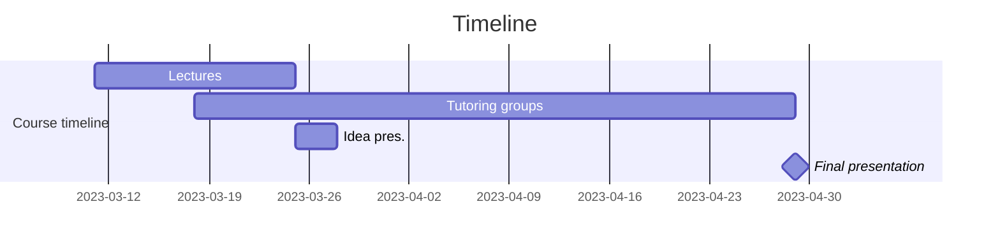
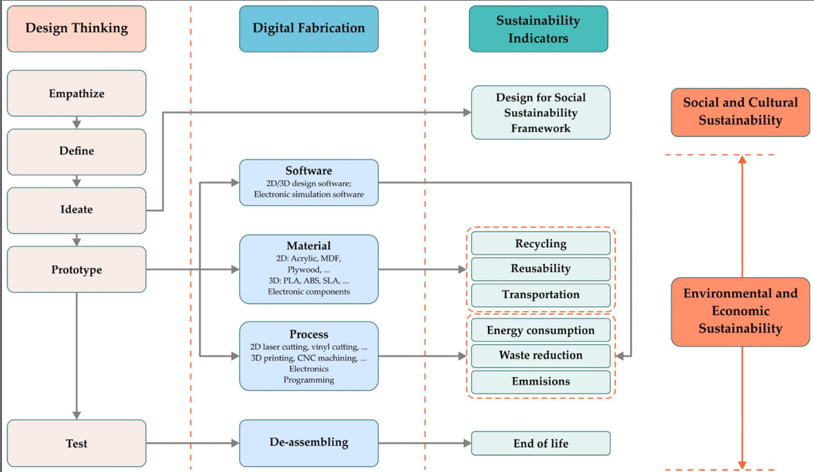
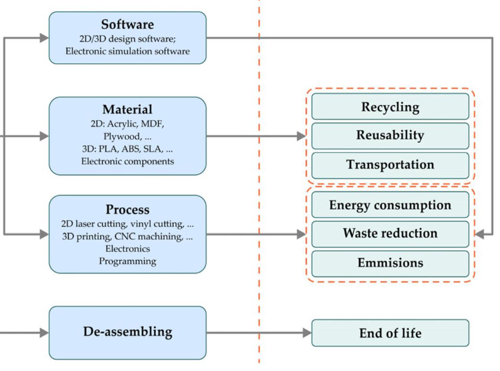

# Principles of digital fabrication G20

Repository of group 20 for the project for `principles of digital fabrication` course.

## Timeline

## Sustainability

## Grading

| What                               | Points       |
| ---------------------------------- | ------------ |
| Design                             | 10           |
| 2D and 3D Modeling and fabrication | 5            |
| Electronics                        | 5            |
| Programming                        | 5            |
| Final prototype                    | 45%          |
| Documentation and presentation     | 15           |
| Participation and group dynamics   | 10           |
| Workload and contribution          | 5 (+7 extra) |
